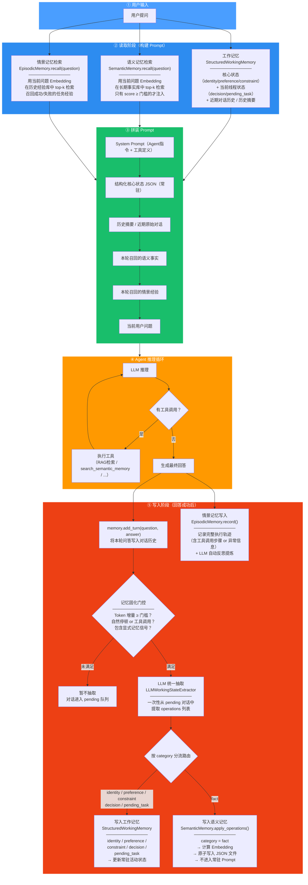
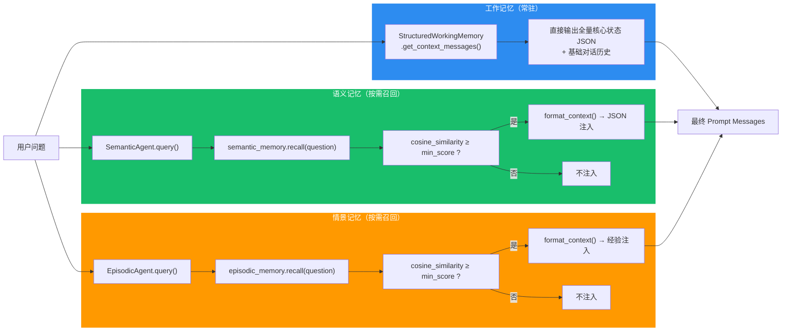
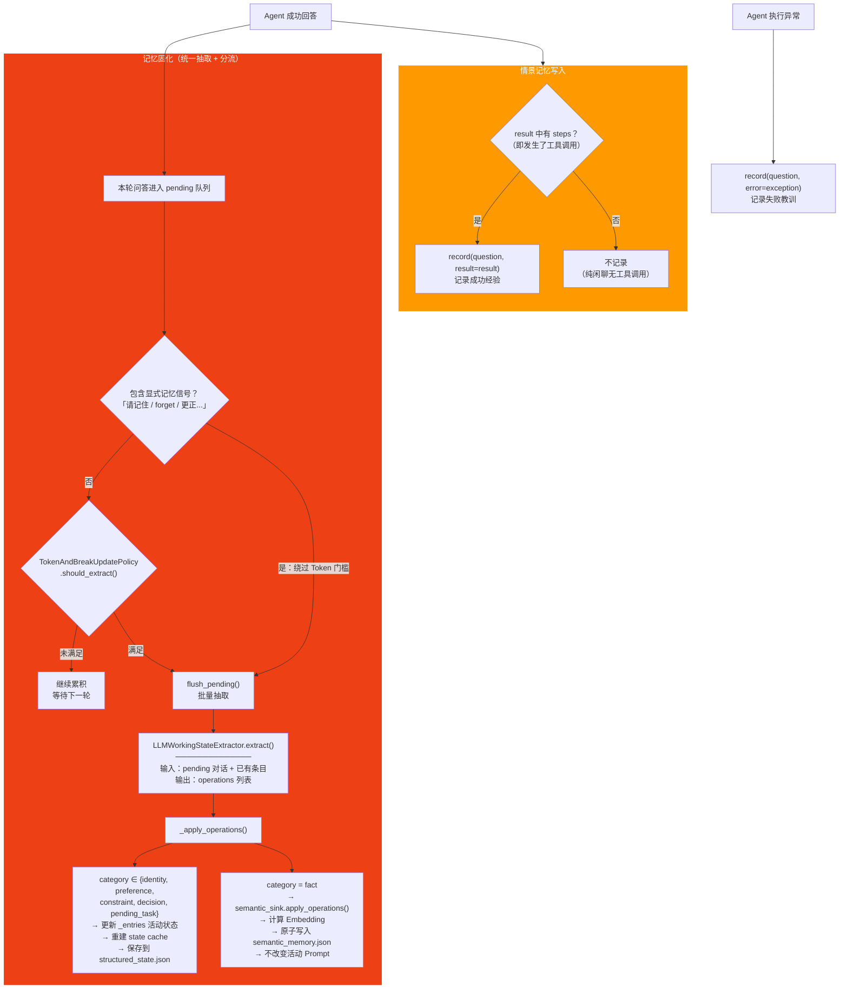
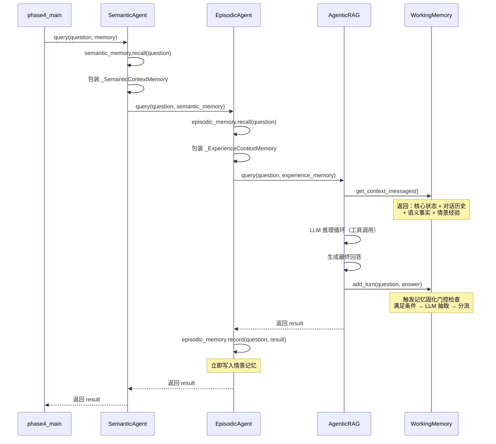

# 三层记忆系统完整流程图

## 一、总览：一轮对话的完整生命周期



---

## 二、读取阶段详解：三种记忆如何进入 Prompt



> [!IMPORTANT]
> 工作记忆**不做向量检索**，内容少且稳定，全量常驻。语义记忆和情景记忆都通过 Embedding 相似度检索，只有达到门槛的才注入。

---

## 三、写入阶段详解：三种记忆的写入触发机制



---

## 四、Prompt 消息排列顺序（Prompt Cache 优化）

按照从**最稳定**到**每轮变化**排列，最大化 Prompt Cache 命中率：

```text
┌─────────────────────────────────────────────────┐
│ 1. System Prompt（Agent 指令 + 工具定义）         │  ← 最稳定，几乎不变
├─────────────────────────────────────────────────┤
│ 2. 结构化核心状态 JSON                           │  ← 低频更新
│    identity / preference / constraint            │
│    decision / pending_task                        │
├─────────────────────────────────────────────────┤
│ 3. 历史摘要 (SummaryBufferMemory)                │  ← 偶尔更新
├─────────────────────────────────────────────────┤
│ 4. 近期原始对话轮次                              │  ← 追加增长
├─────────────────────────────────────────────────┤
│ 5. 本轮自动召回的语义事实                         │  ← 每轮变化
│    SemanticMemory.recall() → format_context()    │
├─────────────────────────────────────────────────┤
│ 6. 本轮召回的情景经验                             │  ← 每轮变化
│    EpisodicMemory.recall() → format_context()    │
├─────────────────────────────────────────────────┤
│ 7. 当前用户问题                                  │  ← 每轮变化
└─────────────────────────────────────────────────┘
```

> [!NOTE]
> 动态内容越靠后，前面稳定前缀的 Prompt Cache 命中率越高。这就是为什么语义事实和情景经验放在历史对话之后、用户问题之前。

---

## 五、三种记忆对比总结

| 维度                  | 工作记忆                                 | 语义记忆                             | 情景记忆                                     |
| :-------------------- | :--------------------------------------- | :----------------------------------- | :------------------------------------------- |
| **存储内容**    | 核心画像 + 线程状态 + 对话历史           | 去上下文化的稳定事实                 | 任务执行的完整轨迹与反思                     |
| **典型示例**    | `identity: user.name = 小明`           | `fact: user.city = 纽约`           | `成功: 用 RAG 回答了 Python 问题`          |
| **写入触发**    | Token 门槛 / 停顿 / 显式信号 → LLM 抽取 | 同左（固化后`fact` 分流过来）      | 每次任务执行完（有工具调用 or 报错）立即记录 |
| **写入方式**    | 更新内存`_entries` + JSON checkpoint   | 计算 Embedding + 原子写 JSON         | LLM 反思 + Embedding + 原子写 JSON           |
| **读取方式**    | **全量常驻** Prompt（无需检索）    | **向量检索** top-k，达门槛注入 | **向量检索** top-k，达门槛注入         |
| **Prompt 位置** | System 后、历史前（最稳定）              | 历史后、问题前（动态）               | 历史后、问题前（动态）                       |
| **作用域**      | 当前线程                                 | 跨线程 / 跨会话                      | 跨线程 / 跨会话                              |

---

## 六、代码层装饰器嵌套关系

[phase4_main.py](file:///Users/williamlao/Project/LLM/src/AIAgent/RAG/phase4_main.py#L457-L475) 中 Agent 的包装顺序：

```text
query_agent = agent                          # 底层 AgenticRAG
query_agent = EpisodicAgent(agent, ...)      # 包一层情景记忆
query_agent = SemanticAgent(query_agent, ...) # 再包一层语义记忆
```

调用 `query_agent.query(question, memory=memory)` 时的执行顺序：


